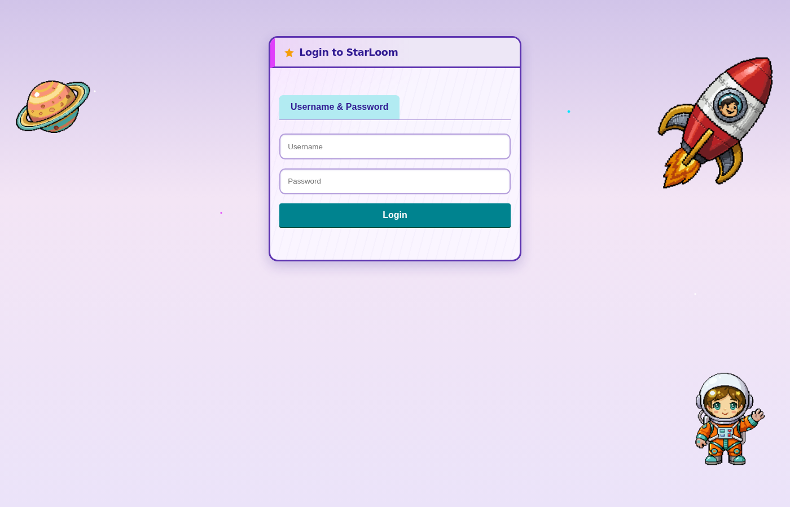
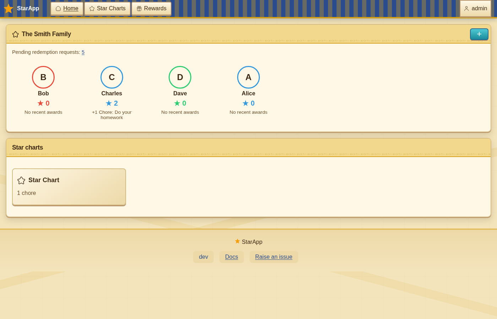
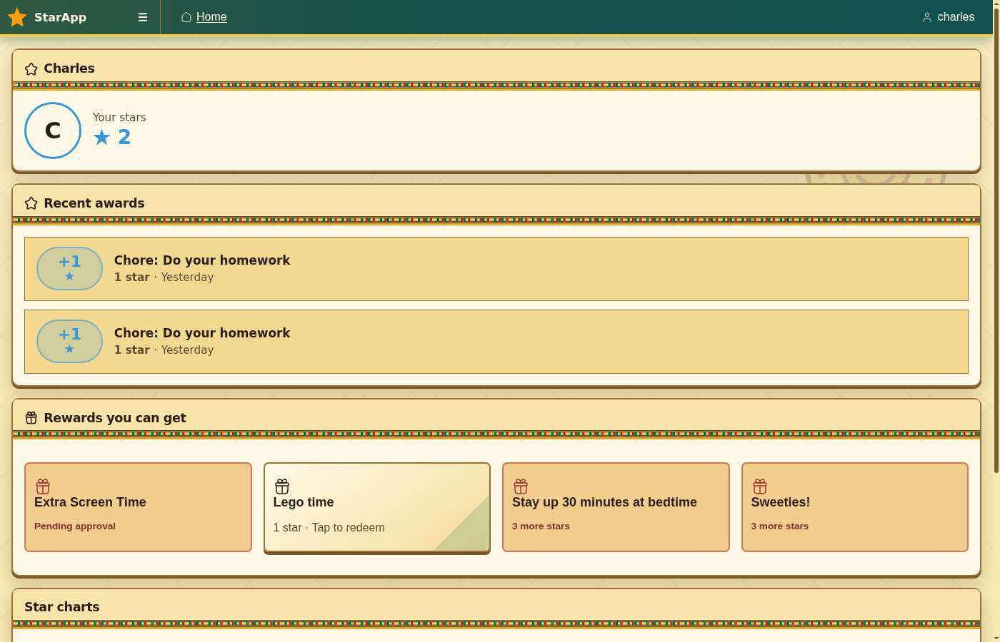
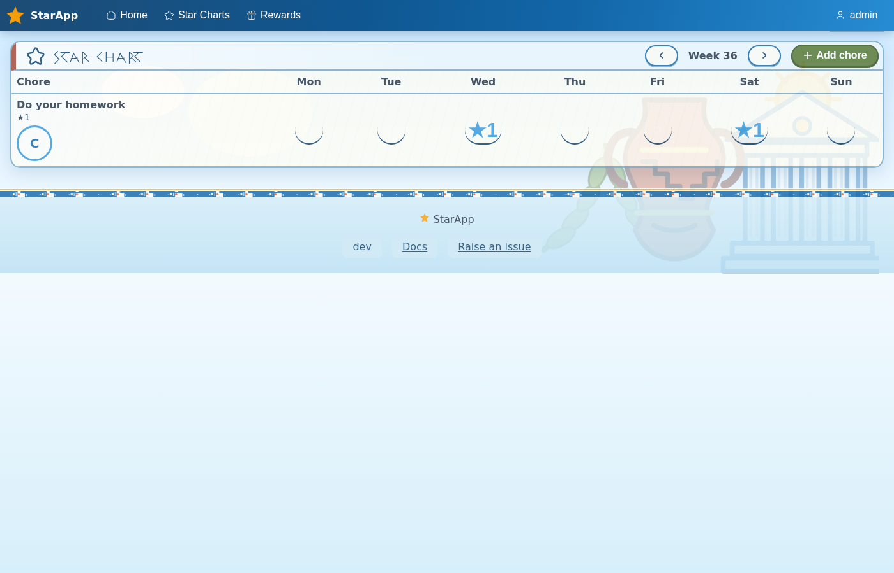
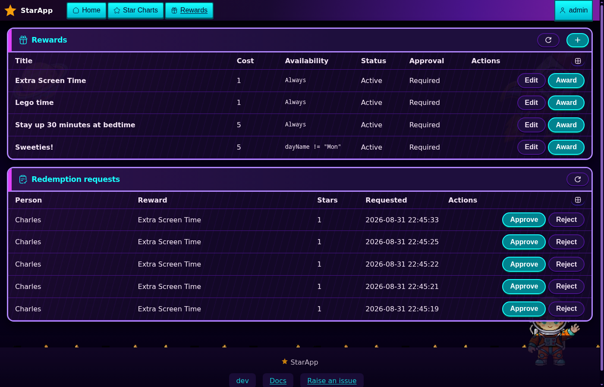
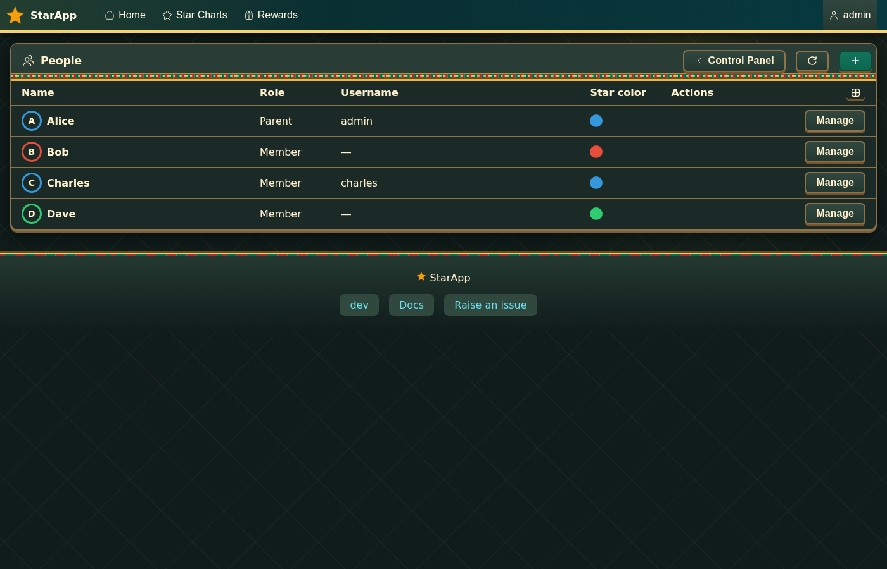
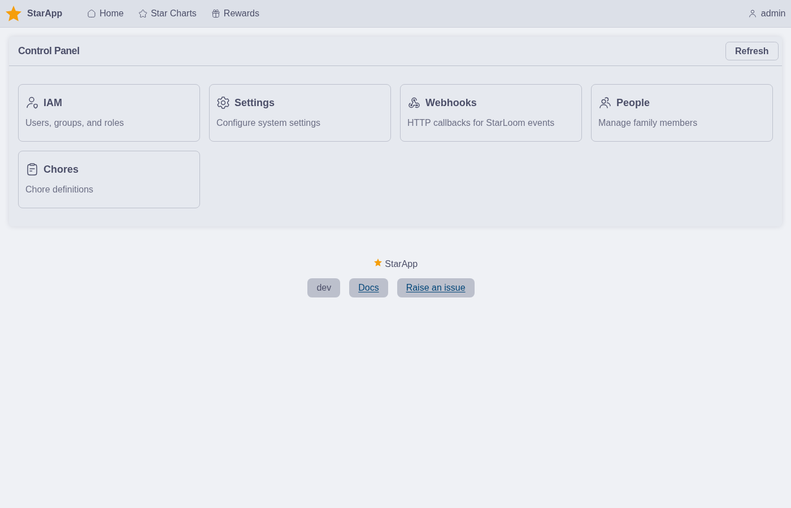
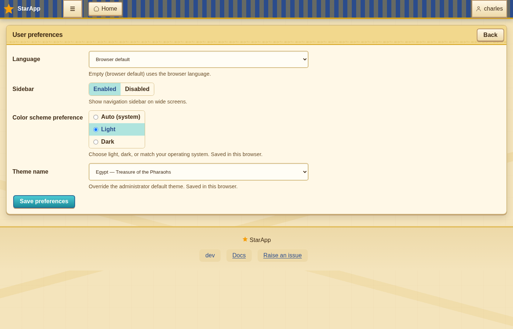

<div align="center">
  
  <h1>StarApp</h1>

  Family star rewards — parents award stars for good behavior; children redeem them for privileges like screen time.

[](#none)
[](https://discord.gg/jhYWWpNJ3v)

</div>

## Screenshots

Login (Space theme);

<p align="center">

</p>

Parent home (Egypt theme) — family overview as a privileged user;

<p align="center">

</p>

Child home (Aztecs theme) — personal stars and rewards;

<p align="center">

</p>

Weekly star chart (Ancient Greece theme);

<p align="center">

</p>

Rewards and redemption requests (Space theme, dark);

<p align="center">

</p>

People (Aztecs theme, dark);

<p align="center">

</p>

Control Panel (Catppuccin theme);

<p align="center">

</p>

User preferences (Egypt theme);

<p align="center">

</p>

## Documentation

- [User manual](docs/content/index.md) — install, setup, and daily use
- [Product specification](docs/SPEC.md)
- [AGENTS.md](AGENTS.md) — AI agent integration (MCP, OpenAPI, llms.txt)

## Linux container

StarApp is published as a multi-arch image on the GitHub Container Registry (`linux/amd64` and `linux/arm64`).

```bash
docker run -d \
  --name starapp \
  --restart unless-stopped \
  -p 8080:8080 \
  -v starapp-config:/config \
  -e STARAPP_SECURE_COOKIES=false \
  ghcr.io/jamesread/starloom:latest
```

`podman run` accepts the same arguments. Open http://localhost:8080 and sign in as **admin** / **admin**. Change that password immediately.

SQLite data and `config.yaml` persist on the `/config` volume. Omit `STARAPP_SECURE_COOKIES=false` when you terminate TLS at a reverse proxy. Pin a release with `ghcr.io/jamesread/starloom:1.2.3` instead of `latest` if you prefer.

## Releases

Container images are published to `ghcr.io/jamesread/starloom` on each release.
See [Install](docs/content/install.md) for pull tags and updates.

## Status

StarApp is a self-hosted family ledger for stars, chores, and rewards. See the
[user manual](docs/content/index.md) to get started, or the
[product spec](docs/SPEC.md) for the full roadmap.
