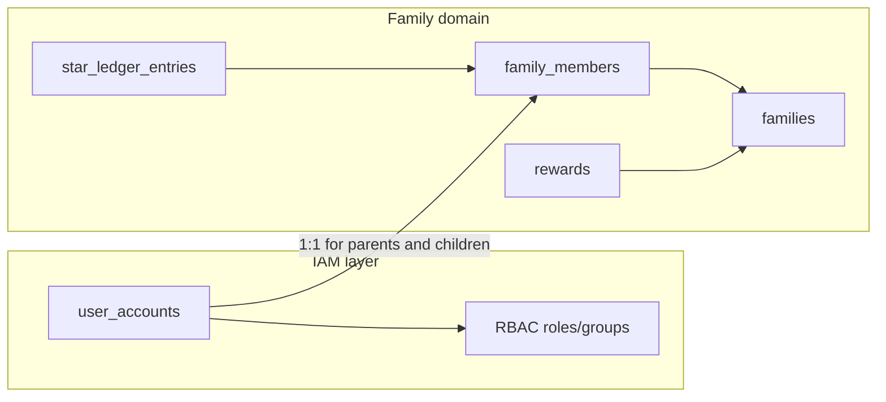

# StarApp — Product Specification

**Status:** Core spec (v1.0)  
**Last updated:** 2026-08-27

---

## Summary

StarApp is a family rewards app. **Stars** are an internal currency: parents award them to children for good behavior, and children spend them on **rewards** such as screen time, treats, or privileges.

The app replaces ad-hoc star charts and verbal IOUs with a shared ledger every family member can trust.

**Primary users:** parents manage the household; children sign in to view their own stars and browse rewards. The **homepage** is role-specific: parents see a family overview of all children and their balances; children see a personal star summary.

---

## Goals

1. Make it easy for parents to award stars quickly and consistently.
2. Give children a clear view of their balance and what they can afford.
3. Keep a durable history of awards and redemptions.
4. Stay simple enough for daily use on phones and tablets at home.

---

## Non-goals (initial release)

- Public social features or leaderboards across families.
- Real-money payments or gift-card integration.
- Automated behavior detection (cameras, wearables, etc.).
- Complex chore scheduling or school-grade tracking (may come later).
- Multi-family membership for a single login account.

---

## Personas and access model

StarApp uses two layers of identity:

1. **IAM layer** — `user_accounts`, sessions, RBAC (already implemented).
2. **Family domain layer** — `families`, `family_members`, ledger, rewards.

Each login account that participates in the star economy links to exactly one **family member** profile. Parents and children both have IAM credentials; permissions determine what they can see and do.

### Parent (primary admin)

- Signs in via IAM (`user_accounts` in the **parent** role / Administrators group).
- Manages the family: add/edit/remove children, upload avatars, define rewards, award and revoke stars, approve redemptions.
- Sees the **family homepage**: all children at a glance with avatars and star balances.
- May use the Control Panel (IAM, Settings, Webhooks) when permitted — unchanged from the current app.

### Child (limited account)

- Each child gets their own IAM login (username + password set by the parent at creation; parent can reset via IAM).
- Assigned to the **Children** user group with the **child** RBAC role — no IAM, Settings, or Control Panel access.
- Sees the **personal homepage**: own balance, recent awards, and reward shop; cannot view siblings' balances or family admin actions.

### v1 decisions

| Decision | Resolution |
|----------|------------|
| Household scope | One family per deployment household; first parent to create a family becomes owner. |
| Parent linkage | Parent IAM accounts link to `family_members` with `role = parent`. |
| Child linkage | Child IAM accounts link to `family_members` with `role = child`. |
| Child authentication | **Child IAM accounts** — each child signs in with credentials the parent created. |
| Audit trail | Ledger `created_by_member_id` references **family member id** (domain actor), not raw `user_accounts`. |
| Homepage routing | SPA chooses layout from RBAC permissions (`stars.view_family` vs `stars.view_own`). |



---

## Core concepts

### Star

A unit of positive credit. Stars are **integer-only** (no fractional stars in v1).

- Awarded by a parent with an optional note (e.g. "Cleaned room without being asked").
- May be **revoked** by a parent with a reason (correction / mistake).
- Stored as **ledger entries**; balance is derived from the sum of entries.

### Reward

Something a child can obtain by spending stars.

Examples:

- 30 minutes of TV time — 5 stars
- Choose dinner — 10 stars
- Stay up 30 minutes late — 15 stars

Each reward has:

- Title and optional description
- **Cost** in stars
- **Active** flag (parents can retire rewards without deleting history)
- Optional **approval required** flag (child requests; parent confirms redemption)

### Redemption

When a child spends stars on a reward:

1. Balance is checked (must be ≥ cost).
2. Stars are debited via a ledger entry.
3. Redemption is recorded with timestamp and optional parent approval.

If approval is required, the redemption stays **pending** until a parent approves or rejects.

### Avatar

An optional profile image for a family member. In v1, parents upload avatars for **child** members only. When no avatar is set, the UI shows a default placeholder (initials or generic icon).

---

## Domain model (v1)

The draft schema in `database/sqlite/migrations/0.base.sql` uses a table named `users` for family members. The implementation will rename this to **`family_members`** and add IAM linkage and avatar support in migration `5.family-members.sql` (deferred).

```
Family
  id, name, created_at

FamilyMember
  id, family_id, user_account_id (nullable until linked),
  display_name, role (parent | child), avatar_path (nullable), created_at

Reward
  id, family_id, title, description, cost_stars, active, approval_required

StarLedgerEntry
  id, family_id, child_member_id, amount (+/-), entry_type (award | revoke | redeem),
  note, related_reward_id (nullable), created_by_member_id, created_at

Redemption
  id, family_id, child_member_id, reward_id, stars_spent,
  status (pending | approved | rejected), ledger_entry_id,
  created_at, resolved_at, resolved_by_member_id,
  fulfilled_at (nullable, UX-only)
```

| Entity | Key fields |
|--------|------------|
| `families` | `id`, `name`, `created_at` |
| `family_members` | `id`, `family_id`, `user_account_id`, `display_name`, `role`, `avatar_path`, `created_at` |
| `rewards` | unchanged from `0.base.sql` |
| `star_ledger_entries` | FK `child_member_id`; `created_by_member_id` |
| `redemptions` | FK `child_member_id`; `resolved_by_member_id`; optional `fulfilled_at` |

**Balance rule:** `child_balance = SUM(star_ledger_entries.amount WHERE child_member_id = ?)`

All balance changes go through the ledger. Never update a separate "balance" column without a matching ledger entry.

---

## Avatars

### Who can manage avatars

- **Parents** may upload, replace, and remove avatars for child members.
- **Children** may view their own avatar only.
- v1 does not require parent avatars; placeholder is acceptable.

### Storage

- Files on disk under `{config_dir}/avatars/{member_id}.{ext}` (self-hosted; no third-party CDN).
- On delete, remove the file and clear `avatar_path` on the member row.

### Validation

- **Formats:** JPEG, PNG, WebP.
- **Max size:** 2 MB.
- Server validates MIME type and dimensions (max 512×512; downscale if larger).

### API

- `UploadMemberAvatar` — parent uploads image bytes for a child member.
- `DeleteMemberAvatar` — parent removes avatar for a child member.
- `GET /avatars/{member_id}` — authenticated fetch; children may only request their own member id; parents may request any family member.

### UI placement

- Circular avatar on parent homepage child cards.
- Child profile edit dialog (parent-only).
- Child personal home header.

---

## Homepage

Route `/` (`frontend/src/views/HomeView.vue`) branches on RBAC permissions. `GetStatus` already returns `rbac_permissions`; the SPA checks `stars.view_family` (parent layout) vs `stars.view_own` (child layout).

### Parent home — Family overview

- **Header:** family name + quick actions (Add child, Manage rewards).
- **Child cards grid** (primary content): avatar, display name, current star balance, last award snippet (note + date). Tap a card → child detail / award flow.
- **Footer strip:** pending redemptions count (when M2 ships).
- **Empty state:** prompt to add the first child.

```
┌─────────────────────────────────────────────────────┐
│  The Smith Family          [+ Add child] [Rewards]  │
├─────────────────────────────────────────────────────┤
│  ┌──────────┐  ┌──────────┐  ┌──────────┐          │
│  │  (avatar)│  │  (avatar)│  │  (avatar)│          │
│  │   Emma   │  │   Noah   │  │   Lily   │          │
│  │  ★ 12    │  │  ★  8    │  │  ★  3    │          │
│  │ +2 today │  │ +1 today │  │ no awards│          │
│  └──────────┘  └──────────┘  └──────────┘          │
├─────────────────────────────────────────────────────┤
│  Pending redemptions: 1                               │
└─────────────────────────────────────────────────────┘
```

### Child home — My stars

- **Header:** own avatar + display name + large balance.
- **Recent awards** list (newest first, paginated).
- **Active rewards** browse + redeem CTA (M2).
- No sibling data, no admin controls.

```
┌─────────────────────────────────────────────────────┐
│  (avatar)  Emma                         ★ 12 stars  │
├─────────────────────────────────────────────────────┤
│  Recent awards                                      │
│  • +2  Cleaned room without being asked   today     │
│  • +1  Helped with dishes                 yesterday │
├─────────────────────────────────────────────────────┤
│  Rewards you can get                                  │
│  • 30 min TV time — 5 stars                         │
│  • Choose dinner — 10 stars                         │
└─────────────────────────────────────────────────────┘
```

---

## RBAC (domain permissions)

Domain permissions extend the existing IAM catalog (`3.iam.sql`). A new migration seeds these permissions and two application roles.

| Permission | Parent | Child | Description |
|------------|--------|-------|-------------|
| `app.access` | yes | yes | Use the application (existing) |
| `family.view` | yes | no | View family name and member list |
| `family.manage` | yes | no | Create/update family |
| `members.manage` | yes | no | Add, edit, remove child members |
| `members.avatar` | yes | no | Upload/remove child avatars |
| `stars.view_family` | yes | no | View all children's balances and history |
| `stars.view_own` | yes | yes | View own balance and history |
| `stars.award` | yes | no | Award stars to children |
| `stars.revoke` | yes | no | Revoke or correct star entries |
| `rewards.manage` | yes | no | CRUD reward catalog |
| `rewards.view` | yes | yes | Browse active rewards |
| `redemptions.approve` | yes | no | Approve or reject pending redemptions |
| `redemptions.request` | yes | yes | Request redemption (parent on behalf of child) |

### Roles

| Role | Permissions |
|------|-------------|
| **superuser** | All permissions (system role; unchanged) |
| **parent** | `app.access` + all domain permissions above except child-only scoping |
| **child** | `app.access`, `stars.view_own`, `rewards.view`, `redemptions.request` |

### User groups

| Group | Role assignment |
|-------|-----------------|
| **Administrators** | `superuser` (existing) |
| **Everyone** | `member` (existing; legacy, superseded for domain by parent/child roles) |
| **Parents** | `parent` (new) |
| **Children** | `child` (new) |

Child accounts must not receive IAM, Settings, or Control Panel permissions (`users.*`, `system.settings`, etc.).

---

## Key workflows

### WF1 — Family setup

1. Parent signs in (IAM bootstrap: **admin** / **admin** on empty database).
2. If no family exists, parent creates a family (name).
3. Parent adds a child: display name, username, initial password → creates `user_account` + `family_members` row + assigns **Children** group / **child** role.
4. Parent optionally uploads an avatar immediately or later.
5. Parent creates rewards (title, cost, active, approval flag) or uses defaults.

### WF2 — Award stars

1. Parent selects a child (from homepage card or child detail).
2. Parent enters star amount (default from cvar `default_award_stars`, typically 1) and optional note.
3. System appends a positive ledger entry with `created_by_member_id` set to the parent member.
4. Child balance updates immediately; webhook `stars.awarded` fires if configured.

### WF3 — Redeem reward

1. Child (or parent on behalf of child) selects an active reward.
2. If `approval_required`: create pending redemption; surface on parent home.
3. Else: debit stars, mark redemption approved, show confirmation.
4. Parent may mark a redemption as **fulfilled** (`fulfilled_at`; optional UX; does not affect balance).

### WF4 — Revoke / correct

1. Parent selects a past award or enters a manual negative adjustment.
2. System appends a negative ledger entry with reason.
3. Redemption rejects insufficient balance. Revokes are capped at current balance (balance cannot go negative).

### WF5 — Child sign-in

1. Child logs in with credentials the parent created.
2. Lands on personal home; all API reads and writes scoped to the linked `family_member_id`.
3. Child cannot access sibling data or admin surfaces.

---

## Functional requirements (MVP)

| ID | Requirement |
|----|-------------|
| FR-1 | Parents can create and manage a family with one or more children. |
| FR-2 | Parents can award stars to a child with an optional note. |
| FR-3 | Parents can define rewards with star cost and active/approval flags. |
| FR-4 | Users can view a child's current balance and ledger history (newest first). |
| FR-5 | Children (or parents) can redeem rewards when balance is sufficient. |
| FR-6 | Pending redemptions can be approved or rejected by a parent. |
| FR-7 | All star movements are auditable (who, when, why). |
| FR-8 | Parents can add children with IAM credentials and manage their profiles. |
| FR-9 | Parents can upload, replace, and remove avatar images for children. |
| FR-10 | Parent homepage shows all family children with avatar, balance, and recent award summary. |
| FR-11 | Child homepage shows only the signed-in child's balance, history, and rewards. |
| FR-12 | Child accounts cannot access Control Panel, IAM, or system settings. |

---

## Non-functional requirements

| ID | Requirement |
|----|-------------|
| NFR-1 | Self-hostable; no third-party analytics or telemetry by default. |
| NFR-2 | Works on modern mobile browsers (primary) and desktop. |
| NFR-3 | API exposed via Connect/gRPC (jwr-soa-2.0). |
| NFR-4 | SQLite acceptable for single-family self-host; abstract storage for tests. |
| NFR-5 | Prometheus metrics on the backend service. |
| NFR-6 | Avatar files stored locally under config directory; no external image service. |

---

## UI surfaces (MVP)

| Surface | Route | Audience | Purpose |
|---------|-------|----------|---------|
| **Family home** | `/` | Parent | Child card grid, balances, quick award |
| **My stars** | `/` | Child | Personal balance, recent awards, reward shop |
| **Child detail** | `/family/children/:id` | Parent | Full history, award/revoke, edit profile, avatar |
| **Rewards admin** | `/family/rewards` | Parent | CRUD rewards |
| **Redemptions** | `/family/redemptions` | Parent | Approval queue (M2) |
| **Control Panel** | `/control-panel/*` | Parent (privileged) | IAM, Settings, Webhooks (existing) |

---

## API outline (protocol/)

Detailed protobuf definitions belong in `protocol/starapp/api/v1/` as implementation progresses.

### FamilyMemberService

| RPC | Purpose |
|-----|---------|
| `GetMyFamily` | Return family and caller's member profile |
| `CreateFamily` | Create household (first parent) |
| `ListMembers` | List family members (scoped by RBAC) |
| `CreateChildMember` | Create child profile + IAM account |
| `UpdateMember` | Update display name / link account |
| `DeleteMember` | Remove child member (guard: no orphan ledger) |
| `UploadMemberAvatar` | Upload avatar image for a child member |
| `DeleteMemberAvatar` | Remove avatar for a child member |

### StarService

| RPC | Purpose |
|-----|---------|
| `AwardStars` | Append positive ledger entry |
| `RevokeStars` | Append negative ledger entry (capped at balance) |
| `GetMemberBalance` | Sum ledger for a child member |
| `ListLedger` | Paginated history (scoped by RBAC) |

### RewardService

| RPC | Purpose |
|-----|---------|
| `ListRewards` | Active catalog for family |
| `CreateReward` | Add reward |
| `UpdateReward` | Edit reward fields |
| `DeleteReward` | Soft-delete via `active = false` |

### RedemptionService

| RPC | Purpose |
|-----|---------|
| `RequestRedemption` | Child or parent requests reward |
| `ApproveRedemption` | Parent approves pending request |
| `RejectRedemption` | Parent rejects pending request |
| `ListRedemptions` | Filter by status / member |

### HomeService (optional convenience)

| RPC | Purpose |
|-----|---------|
| `GetParentHomeSummary` | Children + balances + last award per child in one round-trip |

### Webhook payloads

| Event | Payload fields |
|-------|----------------|
| `stars.awarded` | `family_id`, `child_member_id`, `amount`, `note`, `created_by_member_id`, `created_at` |
| `redemption.requested` | `family_id`, `child_member_id`, `reward_id`, `stars_spent`, `redemption_id` |
| `redemption.resolved` | `redemption_id`, `status`, `resolved_by_member_id`, `resolved_at` |

---

## Technical architecture

StarApp follows [jwr-soa-2.0](https://github.com/jamesread) project layout:

| Path | Purpose |
|------|---------|
| `service/` | Go backend (Connect RPC, koanf config, logrus, prometheus) |
| `frontend/` | Vue 3 + Vite + PicoCrank UI |
| `protocol/` | Protobuf + buf code generation |
| `integration-tests/` | Mocha + Selenium end-to-end tests |
| `docs/` | Product and developer documentation |

Default backend port: **8080** (override with `$PORT`).

---

## Resolved decisions

| Question | Resolution |
|----------|------------|
| Child authentication | Child IAM accounts with parent-created credentials |
| Negative balance | Prevent on redeem; revokes capped at current balance |
| Reward fulfillment | Optional `fulfilled_at` on redemption; does not affect ledger (M2+) |
| Notifications | In-app only for v1; webhooks for external integrations |
| Domain `users` table | Rename to `family_members` in migration `5.family-members.sql` |
| Homepage layout | Permission-based (`stars.view_family` vs `stars.view_own`) |

---

## Milestones

### M0 — Platform (done)

- IAM, sessions, RBAC, Control Panel, Settings, Webhooks, user preferences.
- Spec, repo layout, Makefiles, domain schema draft in `0.base.sql`.

### M1 — Core ledger and members

- Schema alignment (`family_members`, avatars, IAM link) via `5.family-members.sql`.
- RBAC seed for domain permissions and parent/child roles.
- FamilyMember + Star store and Connect RPCs.
- Avatar upload and authenticated serve endpoint.

### M2 — Rewards and redemption

- Reward CRUD, redeem flow, approval queue.
- Webhook dispatch for `stars.awarded`, `redemption.*`.

### M3 — Frontend MVP

- Parent family homepage and child personal home.
- Child management UI, avatar upload, award flow.

### M4 — Hardening

- Integration tests, deployment docs, production checklist.

---

## Glossary

| Term | Meaning |
|------|---------|
| **Star** | Internal point earned for good behavior |
| **Reward** | Catalog item purchasable with stars |
| **Ledger entry** | Immutable record of a star credit or debit |
| **Redemption** | Act of spending stars on a reward |
| **Family member** | Domain profile linking an IAM account to a family (parent or child) |
| **Avatar** | Optional profile image for a family member |
